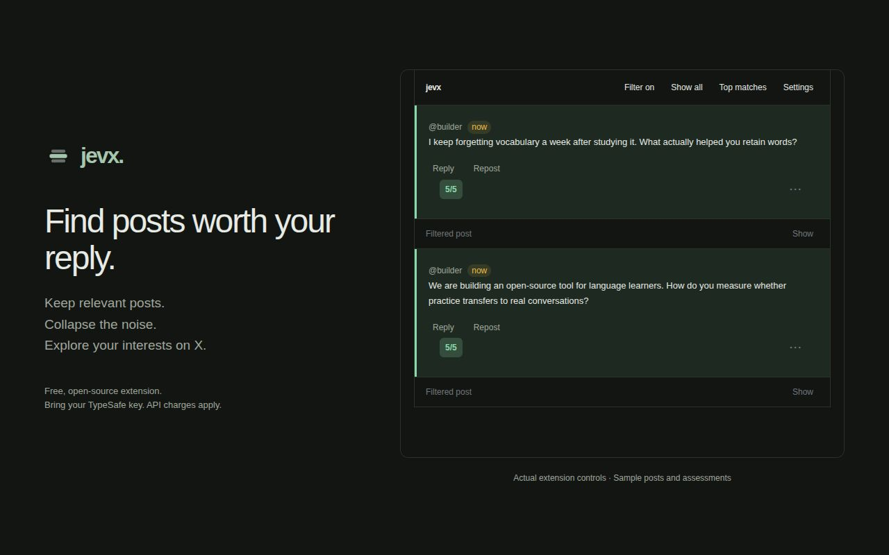
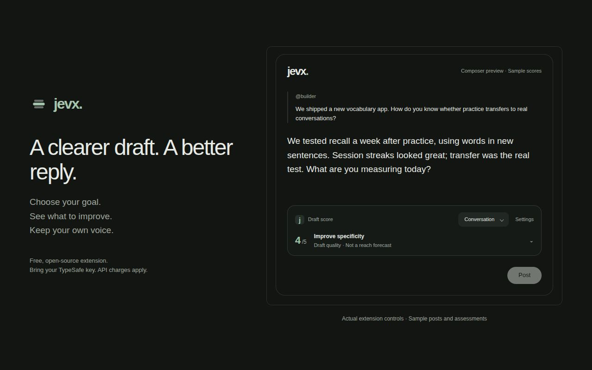

# jevx

A small, open-source Chrome and Firefox extension for finding posts worth replying to on X and improving your drafts.

Save searches. Tell Jev what interests you. Relevant posts stay expanded with a quiet highlight. Other posts collapse into a single row.



The extension and its design files are MIT licensed. AI features require your own TypeSafe key and can incur API charges. There is no jevx subscription or developer-operated backend.

## Install locally

Use Node.js 24, Chrome 116 or later, or Firefox 140 or later.

```sh
npm ci
npm run build
npm run build:firefox
```

**Chrome:** Open `chrome://extensions`. Enable Developer mode. Select **Load unpacked**, then select `.output/chrome-mv3`.

**Firefox:** Open `about:debugging#/runtime/this-firefox`. Select **Load Temporary Add-on**, then select `.output/firefox-mv3/manifest.json`. Firefox removes temporary add-ons after a restart. Allow access to X when Firefox requests it.

Reload existing X tabs after installation.

## Use it

1. Open jevx, then select **Settings**.
2. Enter your interests. Add your background, audience, and exclusions if useful.
3. Enable Jev assessment and save your profile.
4. Enter your own TypeSafe API key. The next assessment checks the key.
5. Add phrases, hashtags, or X search expressions in the popup.
6. Select searches and click **Find posts**.

Searches open in X's Latest view with replies excluded. The extension reuses its search tabs if they still show that search. It does not navigate tabs that you moved elsewhere.

The filter runs automatically on X Home, including **For you** and **Following**, and on loaded posts across X tabs. Saved searches are optional. Use **Settings** in the feed toolbar to set up your profile and key without opening the extension popup.

Notifications pages are excluded, including their sub-tabs. jevx removes its controls and starts no new assessments there. Filtering resumes when you leave Notifications.

**Show** reveals a collapsed post. **Show all** reveals the current tab. **Filter off** pauses filtering across tabs. The **⋯** button opens post actions: find more from the author, search a related topic, or hide the post. Add a search in the popup if you want to save it.

Relevant posts show a score from 1 to 5. Higher scores have a stronger green accent and background tint. Timestamps under one hour old have a gold pill. Click the score for its reason and breakdown. **Top matches** ranks the loaded matches in the current tab without moving X's feed and provides the same post actions.

Relevance has weight 3 and recency has weight 1. Both weights are editable in Settings. Recency falls from 5 to 1 across the freshness window, which starts at 60 minutes. Older posts retain a recency score of 1. Age does not hide a post. Ranking uses the weighted result before rounding the displayed score.

Reposts use the original post's date. Quote posts use their own date and include available quoted text, even without a caption. Replies bypass Jev. Posts with no body or quoted text remain visible without a score.

## Draft scoring

In Settings, enable **Assess my unpublished drafts** separately from feed assessment. With a connected TypeSafe key, a small panel appears below the post, reply, or quote editor. Choose Conversation, Virality, Credibility, or Connection. Each uses editable, unvalidated criteria. Duplicate a profile, add axes, or change weights in **Profiles & scoring axes**.

The panel waits one second after typing stops. All enabled axes are assessed together, one request at a time per composer. Independent composers can run in parallel. Pending edits replace earlier waiting drafts. Results for changed text are ignored. Open the score to see individual 1–5 scores; missing context is excluded from the rounded weighted average. This is a writing-quality assessment, not a validated prediction of views.

Selected profiles are remembered separately for posts, replies, and quotes. Compatible axis results use a session cache. Changing weights does not require new AI judgments. Draft text is not stored by jevx. With draft consent enabled, unpublished text, available parent/quoted text, and your profile go to TypeSafe. Draft scoring is independent of the feed filter switch and skips Notifications and direct-message pages. The draft type can be corrected in the expanded panel when X's markup is ambiguous.



Preview it with `/design/preview.html?view=draft`. Preview scores are synthetic.

## Data and cost

| Data | Storage or destination |
| --- | --- |
| Profile, saved searches, filter preference, consent | This browser's local extension storage |
| Draft scoring profiles, weights, selected goals, draft consent | This browser's local extension storage |
| TypeSafe key | Extension-origin IndexedDB; persists across restarts until you disconnect or remove the extension |
| Assessments | Session storage with a one-hour cache lifetime |
| Show/Hide choices | Session storage; removed at browser restart |
| Managed search tab IDs | Session storage |
| Eligible post text, quoted text, author, profile | TypeSafe, only after you enable assessment |
| Unpublished drafts, available parent/quoted text, profile, scoring criteria | TypeSafe, only after you enable draft scoring |

The extension has no subscription, server, analytics, or X API dependency. TypeSafe charges for API use. Check [current pricing](https://docs.typesafe.ai/models). Your key never enters X's page scripts. Post text is not persisted by jevx.

Assessments are shared across tabs. Cache keys hash the post content, profile, model, and criteria version. Profile edits invalidate previous matches. Weight changes recalculate scores from cached relevance without another Jev request. A feed service failure stops further feed requests until you pause and resume or update settings. Failed draft requests can retry after another edit. Request failures remain visible. Posts marked **More context needed** collapse and can be revealed with **Show**.

**Concurrent Jev requests** in Settings defaults to 20. One shared pool bounds feed and draft requests across all tabs. Each feed request includes visibility, reason, and relevance; each draft request includes all missing enabled axes. Different posts use separate concurrent calls, following TypeSafe's [re-ranking pattern](https://docs.typesafe.ai/cookbooks/rerank_typesafe). Questions within each call run in parallel, as described in its [multiple-question guide](https://docs.typesafe.ai/patterns/fan-out). Identical pending assessments share a result. This limit is a product setting, not a claim about your TypeSafe account's rate limit.

## Development

```sh
npm run dev
npm run dev:firefox
npm run typecheck
npm test
npm run build:firefox
npm run lint:firefox
npm run zip
npm run zip:firefox
```

For a local interface preview with synthetic posts and mocked assessments:

```sh
npm run preview
```

Open `/design/preview.html`. See [all design previews and editable sources](design/README.md), including settings, the feed, composers, and store artwork. Preview data does not persist. Preview files are not included in extension builds.

Read [CONTRIBUTING.md](CONTRIBUTING.md) before making changes. Use [SECURITY.md](SECURITY.md) for sensitive reports.

## Current limits

- The extension reads only posts X loads. It does not crawl, scroll automatically, or guarantee complete search coverage.
- Reply detection supports the observed English layout. Other languages remain unassessed. X can change its markup; ambiguous or missing dates remain visible.
- Thread pages can omit reply markers. The opened post uses the same English reply-marker check as Home; a missing marker can cause a reply to be assessed as a post. Other thread posts are excluded.
- Collapsed rows remain separate. X's virtualized feed can affect spacing and scrolling; use **Show all** if the layout behaves incorrectly.
- Jev sees text, not images or videos. Posts assessed as needing more context collapse. Posts with no text bypass assessment and remain unscored.
- The API contract, background flow, and UI use automated tests with mocked responses. Real Jev relevance quality requires a user key and review of actual matches.
- The request timeout, cache lifetime, and initial visual tokens are explicitly unvalidated settings. Adjust them from measured behavior.

The [MIT license](LICENSE) covers the project's code and supplied design assets. Bundled runtime notices are in [THIRD_PARTY_NOTICES.txt](public/THIRD_PARTY_NOTICES.txt). jevx is not affiliated with X or TypeSafe.

## Release

Run `npm run release` to test, type-check, build, validate, and package both browsers. ZIP files and the Firefox source archive appear in `.output`.

See [store text and submission steps](docs/STORE.md), [reviewer build instructions](docs/BUILD.md), and the [privacy policy](public/privacy.html). The policy is also available from Settings. Store submission needs a public policy URL, publisher details, and reviewer access; these are not included in the source package.
